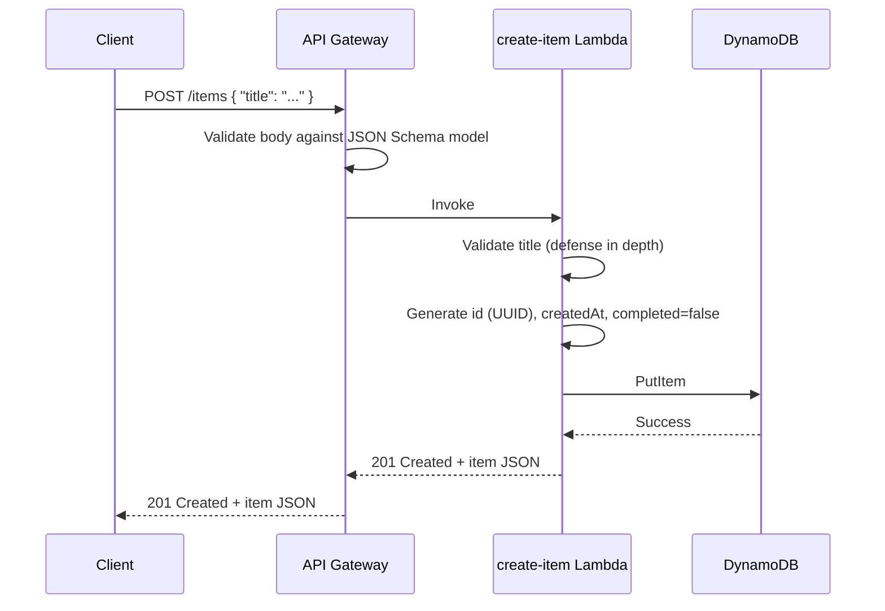
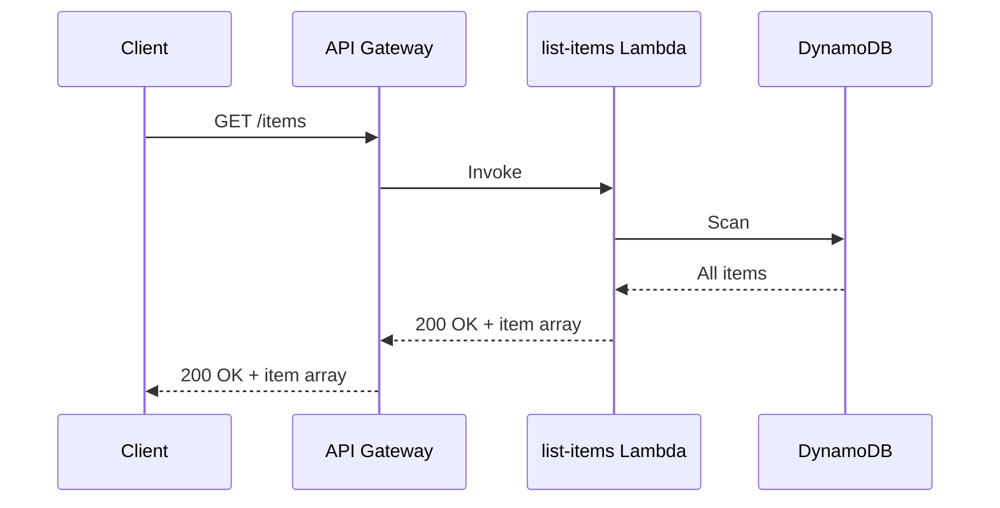
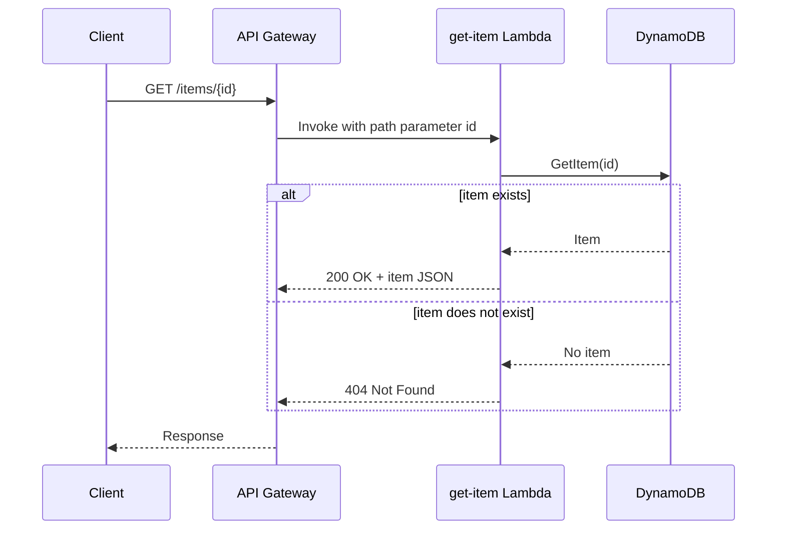
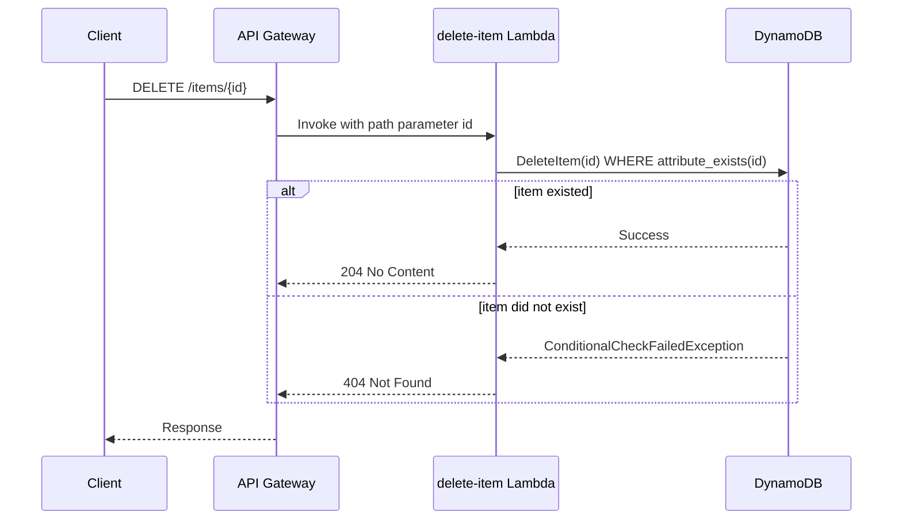

# Architecture

🌐 Language: **English** | [Español](es/architecture.md)

This document goes one level deeper than the README. It describes the
system from the client's point of view, walks through each request type,
and explains how the CDK source in this repository becomes running AWS
infrastructure.

## System context

From a client's perspective, this project is a single HTTPS endpoint that
accepts and returns JSON:

```text
                          HTTPS (JSON in / JSON out)
Client  ───────────────────────────────────────────────►  Task API
```

The client has no knowledge of Lambda, DynamoDB, or IAM. It only sees an
API Gateway URL and a small set of routes:

```text
POST   /items
GET    /items
GET    /items/{id}
DELETE /items/{id}
```

Everything behind that URL — routing, compute, and storage — is described
below.

## Components

**Amazon API Gateway (REST API)**
Terminates HTTPS from the client, matches the request against the
configured routes, optionally validates the request body against a JSON
Schema model, and invokes the corresponding Lambda function with a
structured event. It also writes access logs to CloudWatch.

**AWS Lambda**
Runs one small TypeScript function per operation (`create-item`,
`list-items`, `get-item`, `delete-item`). Each function validates its
input, calls DynamoDB through the AWS SDK v3, and returns a structured
JSON response. Lambda handles provisioning, scaling, and patching the
execution environment — there are no servers to manage.

**Amazon DynamoDB**
A single table, partitioned by `id`, stores every task item. DynamoDB is
a managed key-value/document store: it scales throughput automatically
under on-demand billing and requires no capacity planning for this
workload size.

**AWS IAM**
Each Lambda function has its own execution role. Each role is granted
exactly one DynamoDB action — for example, `create-item` can call
`PutItem` but nothing else. IAM is what turns "least privilege" from a
principle into an enforced boundary.

**Amazon CloudWatch**
Every Lambda function and the API Gateway stage write logs to their own
CloudWatch Log Group. These logs are the primary way to answer "what
happened during this request?" after the fact.

**AWS CDK / AWS CloudFormation**
The infrastructure above is defined once, in TypeScript, in
`lib/serverless-rest-api-stack.ts`. `cdk synth` compiles that definition
into a CloudFormation template; CloudFormation then creates, updates, or
deletes the underlying AWS resources to match it.

## Request flows

### POST /items



### GET /items



### GET /items/{id}



### DELETE /items/{id}



## Infrastructure deployment flow

```text
CDK TypeScript (lib/serverless-rest-api-stack.ts)
      │  cdk synth
      ▼
CloudFormation template (cdk.out/*.template.json)
      │  cdk deploy
      ▼
AWS CloudFormation
      │  creates/updates resources to match the template
      ▼
Running AWS resources (API Gateway, Lambda, DynamoDB, IAM, CloudWatch)
```

`cdk synth` never talks to AWS — it only compiles TypeScript into a
template. `cdk deploy` is the step that actually calls CloudFormation and
provisions or updates real resources. `cdk destroy` runs the same
CloudFormation mechanism in reverse, tearing resources back down.

## Design decisions

**One Lambda per route, not one Lambda for the whole API.**
Each function is small, has a single IAM policy attached to it, and can be
read start-to-finish in under a minute. This makes the relationship
between "what this code does" and "what permissions it needs" obvious,
which is the main teaching goal of this repository. See the README's
"Architectural alternatives considered" section for the tradeoff against a
single router Lambda.

**DynamoDB over a relational database.**
The access pattern here — fetch or write a single item by an opaque ID,
plus a small full-table listing — needs no joins, foreign keys, or
transactions. DynamoDB removes the need to manage database servers,
connections, or scaling, which keeps the example focused on the API
layer instead of database administration.

**Scan for GET /items instead of a Query.**
There is no secondary access pattern here (no "list items by user," no
"list items created after X"), so there is no natural key to `Query`
against without adding a Global Secondary Index purely to support
listing. A full `Scan` is simple, correct, and cheap at the data volumes
this example is meant to run at. It would not be the right choice for a
table with thousands of items or frequent listing traffic — see
`docs/cost-considerations.md` and the README's production considerations.

**API Gateway REST API instead of HTTP API.**
The REST API surface demonstrates request models, request validators, and
CloudWatch access logging directly in CDK, which are useful teaching
points. HTTP API is a lighter-weight, generally cheaper alternative for
APIs that don't need these features — see the README for a fuller
comparison.

**Explicit `PolicyStatement`s instead of `table.grantReadWriteData()`.**
CDK's grant helpers (`grantReadData`, `grantWriteData`,
`grantReadWriteData`) are convenient but each one bundles multiple
DynamoDB actions together. Writing an explicit `PolicyStatement` with a
single action per function makes the least-privilege boundary visible in
the stack definition itself, instead of hidden inside a helper method.
