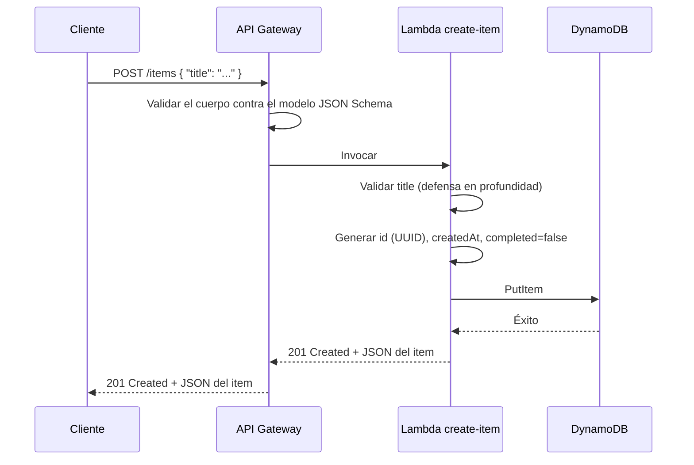
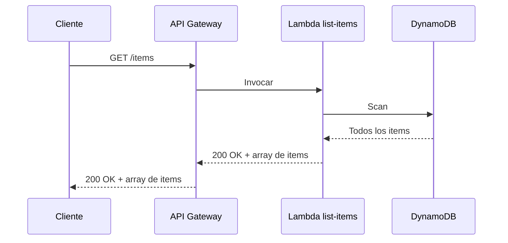
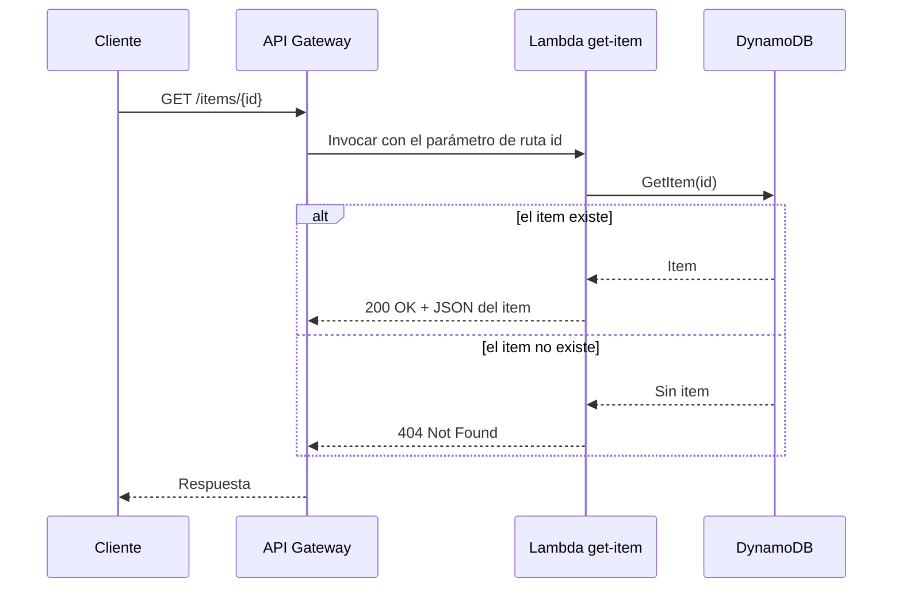
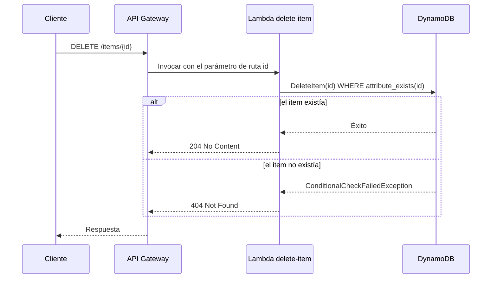

# Arquitectura

🌐 Idioma: [English](../architecture.md) | **Español**

Este documento profundiza un nivel más que el README. Describe el sistema
desde el punto de vista del cliente, recorre cada tipo de solicitud, y
explica cómo el código CDK de este repositorio se convierte en
infraestructura de AWS en ejecución.

## Contexto del sistema

Desde la perspectiva de un cliente, este proyecto es un único endpoint
HTTPS que acepta y devuelve JSON:

```text
                          HTTPS (JSON de entrada / JSON de salida)
Cliente  ───────────────────────────────────────────────►  API de Tareas
```

El cliente no tiene conocimiento de Lambda, DynamoDB, ni IAM. Solo ve una
URL de API Gateway y un pequeño conjunto de rutas:

```text
POST   /items
GET    /items
GET    /items/{id}
DELETE /items/{id}
```

Todo lo que hay detrás de esa URL —enrutamiento, cómputo y
almacenamiento— se describe a continuación.

## Componentes

**Amazon API Gateway (REST API)**
Termina el HTTPS proveniente del cliente, hace coincidir la solicitud con
las rutas configuradas, opcionalmente valida el cuerpo de la solicitud
contra un modelo JSON Schema, e invoca la función Lambda correspondiente
con un evento estructurado. También escribe logs de acceso en
CloudWatch.

**AWS Lambda**
Ejecuta una pequeña función TypeScript por operación (`create-item`,
`list-items`, `get-item`, `delete-item`). Cada función valida su entrada,
llama a DynamoDB a través del AWS SDK v3, y devuelve una respuesta JSON
estructurada. Lambda se encarga de aprovisionar, escalar y parchear el
entorno de ejecución — no hay servidores que administrar.

**Amazon DynamoDB**
Una única tabla, particionada por `id`, almacena cada item de tarea.
DynamoDB es un almacén administrado de clave-valor/documentos: escala su
throughput automáticamente bajo facturación on-demand y no requiere
planificación de capacidad para este tamaño de carga de trabajo.

**AWS IAM**
Cada función Lambda tiene su propio rol de ejecución. A cada rol se le
otorga exactamente una acción de DynamoDB — por ejemplo, `create-item`
puede llamar a `PutItem` pero nada más. IAM es lo que convierte el
"mínimo privilegio" (least privilege) de un principio en un límite
efectivamente aplicado.

**Amazon CloudWatch**
Cada función Lambda y el stage de API Gateway escriben logs en su propio
grupo de logs (Log Group) de CloudWatch. Estos logs son la forma
principal de responder "¿qué ocurrió durante esta solicitud?" después de
los hechos.

**AWS CDK / AWS CloudFormation**
La infraestructura anterior se define una sola vez, en TypeScript, en
`lib/serverless-rest-api-stack.ts`. `cdk synth` compila esa definición en
una plantilla de CloudFormation; CloudFormation luego crea, actualiza o
elimina los recursos de AWS subyacentes para que coincidan con ella.

## Flujos de solicitud

### POST /items



### GET /items



### GET /items/{id}



### DELETE /items/{id}



## Flujo de despliegue de infraestructura

```text
CDK en TypeScript (lib/serverless-rest-api-stack.ts)
      │  cdk synth
      ▼
Plantilla de CloudFormation (cdk.out/*.template.json)
      │  cdk deploy
      ▼
AWS CloudFormation
      │  crea/actualiza recursos para que coincidan con la plantilla
      ▼
Recursos de AWS en ejecución (API Gateway, Lambda, DynamoDB, IAM, CloudWatch)
```

`cdk synth` nunca se comunica con AWS — solo compila TypeScript en una
plantilla. `cdk deploy` es el paso que efectivamente llama a
CloudFormation y aprovisiona o actualiza recursos reales. `cdk destroy`
ejecuta el mismo mecanismo de CloudFormation a la inversa, desmontando
los recursos.

## Decisiones de diseño

**Un Lambda por ruta, no un único Lambda para toda la API.**
Cada función es pequeña, tiene una única política IAM asociada, y puede
leerse de principio a fin en menos de un minuto. Esto hace que la
relación entre "qué hace este código" y "qué permisos necesita" sea
obvia, que es el principal objetivo didáctico de este repositorio. Ver la
sección "Alternativas arquitectónicas consideradas" del README para la
comparación con un único Lambda tipo router.

**DynamoDB en lugar de una base de datos relacional.**
El patrón de acceso aquí — obtener o escribir un único item por un ID
opaco, más un listado completo de la tabla pequeño — no necesita joins,
claves foráneas ni transacciones. DynamoDB elimina la necesidad de
administrar servidores de base de datos, conexiones o escalado, lo que
mantiene el ejemplo enfocado en la capa de API en lugar de en la
administración de bases de datos.

**Scan para GET /items en lugar de una Query.**
No existe un patrón de acceso secundario aquí (ningún "listar items por
usuario", ningún "listar items creados después de X"), así que no hay una
clave natural contra la cual hacer `Query` sin agregar un índice
secundario global (Global Secondary Index) únicamente para soportar el
listado. Un `Scan` completo es simple, correcto y económico a los
volúmenes de datos para los que está pensado este ejemplo. No sería la
elección correcta para una tabla con miles de items o con tráfico de
listado frecuente — ver `docs/es/cost-considerations.md` y las
consideraciones para producción del README.

**API Gateway REST API en lugar de HTTP API.**
La superficie de REST API demuestra modelos de solicitud, validadores de
solicitud y el registro de logs de acceso de CloudWatch directamente en
CDK, lo cual son puntos didácticos útiles. HTTP API es una alternativa
más liviana y en general más económica para APIs que no necesitan estas
características — ver el README para una comparación más completa.

**`PolicyStatement`s explícitas en lugar de `table.grantReadWriteData()`.**
Los helpers de grant de CDK (`grantReadData`, `grantWriteData`,
`grantReadWriteData`) son convenientes, pero cada uno agrupa varias
acciones de DynamoDB juntas. Escribir una `PolicyStatement` explícita con
una única acción por función hace que el límite de mínimo privilegio sea
visible directamente en la definición del stack, en lugar de estar oculto
dentro de un método helper.
